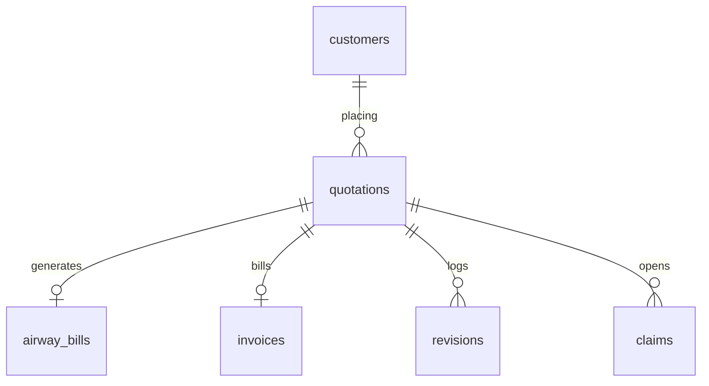

# Database Schema Documentation

This document describes the structure of the SQLite database (`database.sqlite`) created for the **Air Freight Quotation Management System**.

---

## Entity Relationship Model

The system utilizes an SQL relational schema configured with foreign keys enabled to enforce relational integrity.

---

## Table Definitions

### 1. `customers`
Stores registered exporter/shipper accounts who place cargo quotation requests.
- `id` (TEXT, PRIMARY KEY): Unique identifier.
- `name` (TEXT, NOT NULL): Exporter point-of-contact full name.
- `email` (TEXT, NOT NULL): Contact billing email.
- `phone` (TEXT, NOT NULL): Contact telephone.
- `company` (TEXT, NOT NULL): Shippers corporate brand.
- `created_at` (DATETIME): Auto-timestamp.

### 2. `airports`
Logistics lookup directory containing airport codes.
- `code` (TEXT, PRIMARY KEY): 3-letter IATA code (e.g., BOM, FRA, JFK).
- `name` (TEXT, NOT NULL): Full airport name.
- `city` (TEXT, NOT NULL): City served.
- `country` (TEXT, NOT NULL): Country.

### 3. `airline_rates`
Slab lookup rates for routes.
- `id` (INTEGER, PRIMARY KEY AUTOINCREMENT): Row ID.
- `airline_name` (TEXT): Operating air carrier.
- `origin` (TEXT): Origin airport code.
- `destination` (TEXT): Destination airport code.
- `rate_per_kg` (REAL): Base routing rate per kg.
- `transit_days` (INTEGER): Average route duration.
- `validity` (TEXT): Expiration date.

### 4. `quotations`
Core transactional records of generated quotes.
- `id` (TEXT, PRIMARY KEY): Quote identifier.
- `customer_id` (TEXT, FOREIGN KEY): Refers to `customers.id`.
- `origin` (TEXT): Origin airport code.
- `destination` (TEXT): Destination airport code.
- `cargo_type` (TEXT): Commodity category.
- `package_count` (INTEGER): Quantity of boxes.
- `actual_weight` (REAL): Gross physical weight in kg.
- `length`, `width`, `height` (REAL): Physical dimensions in cm.
- `volumetric_weight` (REAL): Computed volumetric bulk weight (L*W*H*pcs)/5000.
- `chargeable_weight` (REAL): Max of actual and volumetric weight.
- `urgency` (TEXT): Urgency tier: `Standard`, `Express`, `Flash`.
- `base_price` (REAL): Dynamic freight cost.
- `fuel_surcharge` (REAL): Fuel adjustments.
- `security_charge` (REAL): Security fees.
- `urgency_charge` (REAL): Priority surcharge.
- `total_price` (REAL): Total invoice estimate.
- `status` (TEXT): Life-cycle state: `Draft`, `Pending Approval`, `Approved`, `Rejected`, `Revision Required`.
- `owner` (TEXT): Logistics owner.
- `remarks` (TEXT): Internal routing remarks.
- `created_at`, `updated_at` (DATETIME): Chronological timestamps.

### 5. `revisions`
Archive logs tracking quote changes.
- `id` (INTEGER, PRIMARY KEY): Revision ID.
- `quotation_id` (TEXT, FOREIGN KEY): Reference to `quotations.id`.
- `revision_number` (INTEGER): Version counter.
- `previous_data` (TEXT): Full stringified JSON state of quotation parameters prior to edits.
- `reason` (TEXT): Explanation of changes.
- `updated_by` (TEXT): Name of staff member who submitted changes.
- `created_at` (DATETIME): Timestamp of modification.

### 6. `airway_bills`
Shipment master tracking generated upon quote approval.
- `id` (TEXT, PRIMARY KEY): Airway bill reference.
- `quotation_id` (TEXT, FOREIGN KEY): Link to `quotations.id`.
- `awb_number` (TEXT, UNIQUE): Airline code + serial identifier (e.g. 074-12345678).
- `flight_number` (TEXT): Scheduled freighter flight (e.g. EK-501).
- `warehouse_location` (TEXT): Aisle and shelf bin coordinates (e.g. Aisle B - Shelf 3).
- `dispatch_status` (TEXT): Leg tracking state: `Received`, `Processed`, `Departed`, `In-Transit`, `Arrived`, `Delivered`.
- `updated_at` (DATETIME): Date of latest tracking scan.

### 7. `invoices`
Billing statements issued upon approval.
- `id` (TEXT, PRIMARY KEY): Invoice ref.
- `quotation_id` (TEXT, FOREIGN KEY): Link to `quotations.id`.
- `invoice_number` (TEXT, UNIQUE): Standard billing serial identifier.
- `amount` (REAL): Amount invoiced.
- `payment_status` (TEXT): Settlement state: `Unpaid`, `Paid`, `Overdue`.
- `due_date` (DATETIME): Payment terms deadline.
- `created_at` (DATETIME): Issuance timestamp.

### 8. `claims`
Customer support incident reports.
- `id` (TEXT, PRIMARY KEY): Ticket ID.
- `quotation_id` (TEXT, FOREIGN KEY): Link to `quotations.id`.
- `claim_type` (TEXT): Incident type: `Complaint`, `Insurance Claim`.
- `status` (TEXT): Resolution lifecycle: `Submitted`, `Investigating`, `Approved`, `Rejected`.
- `details` (TEXT): Exporters description of loss, damage, or delay.
- `claim_amount` (REAL): Requested compensation payout.
- `created_at` (DATETIME): Logged timestamp.
