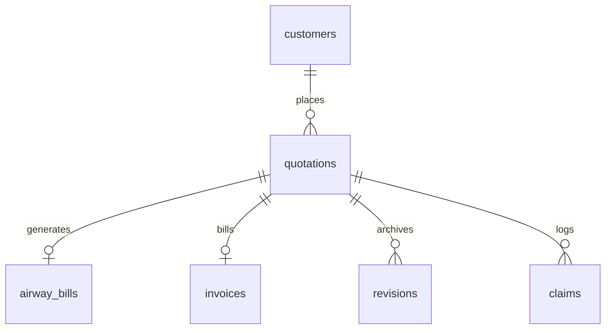

# Air Freight Quotation Management System
## Final Project Reference Implementation Report
**Company**: ORBEM Solutions Private Limited  
**Duration**: 01 June 2026 - 30 June 2026 (26 Working Days)  
**Roles**: Student 1 (Frontend) | Student 2 (Backend) | Student 3 (Testing & Deployment)

---

## 1. Executive Summary & Problem Statement

### 1.1 About the Company
ORBEM Solutions Private Limited operates in global air cargo logistics, coordinating pickup, warehousing, airway bill document verification, invoicing, and claims handling. Managing high volumes of cargo requests daily requires fast, consistent pricing estimations and follow-ups.

### 1.2 The Problem
Operations staff currently calculate freight quotations manually. They consult multiple static charts for slab discount rates, calculate package volumes manually, and handle customer communication over scattered channels (WhatsApp, calls). This manual procedure results in:
- High latency in responding to priority shipping queries.
- Data inconsistencies in quoting similar routes and weights.
- Lack of centralized records for revision history, airway bills, and payment terms.
- Delays in managing exporter loss/damage claims.

### 1.3 The Solution
The **Air Freight Quotation Management System** is a smart web prototype designed to:
1. Automate volumetric weight and dynamic slab rate pricing calculations.
2. Provide a structured workflow status ledger for cargo admins.
3. Integrate an AI Cargo Assistant that cleans commodity descriptions, lists customs checklists, suggests routing legs, and compares carrier rates.
4. Issue automated airway bills (AWB), invoice logs, and track warehouse shelf placements.
5. Record detailed revision logs and audit trails for audit compliance.

---

## 2. Lit Survey & Existing System Analysis

### 2.1 Literature Survey
1. **IATA Cargo Standards (IATA Cargo Handling Manual)**: Standardizes volumetric weight calculation: `(L x W x H in cm) / 5000` to establish chargeable rates.
2. **RESTful API Patterns (Fielding, 2000)**: Recommends stateless endpoints to create (`POST /quotes`), retrieve (`GET /quotes`), and edit (`PUT /quotes/:id/status`) logistics entities.
3. **Relational Database Design (Codd, 1970)**: Stresses referential foreign keys (e.g. mapping airway bills to quotations) to ensure consistency.

### 2.2 Existing Systems vs Proposed System

| Dimension | Legacy Systems (Manual) | Proposed System |
|---|---|---|
| **Weight Calculations** | Manual arithmetic; prone to errors | Automatic volumetric calculations |
| **Pricing Rules** | Static PDF rate sheets | Slab rate discounts applied dynamically |
| **Audit Log** | Paper files and spreadsheet edits | SQLite `revisions` table logging JSON states |
| **Cargo Tracking** | Manual check-ins and phone calls | Milestone stepper linked to AWB tracking |
| **Incident Room** | Separated email/WhatsApp chats | Centralized claims registration ledger |

---

## 3. System Design & Database Schema

The system uses **SQLite** for zero-config persistence, mapped to standard relational constraints.



### Table Structure Summary
- `customers`: Exporters name, billing email, company details.
- `airline_rates`: Cargo base routes.
- `quotations`: Volumetric weight, base price, fuel, handling, and urgency surcharges.
- `revisions`: Stringified JSON files of prior versions, revision counts, reasons.
- `airway_bills`: 074-prefix AWB tracker, flight numbers, shelf racks, leg milestones.
- `invoices`: Invoiced amounts, payment status, terms deadlines.
- `claims`: Support incidents, complaints, insurance compensation amounts.

---

## 4. Implementation Details

### 4.1 Backend APIs (`backend/server.js`)
- Exposes clean JSON REST endpoints.
- Implements robust error try/catch blocks returning 400 for validation issues and 500 for SQL errors.
- Triggers automatic generation of Airway Bills and Invoices upon quote approval.

### 4.2 Frontend Presentation (`frontend/`)
- **Main View**: Dashboard detailing approved revenues, active shipments, and charts.
- **Quotation Creator**: Inline shipper registrar, route dropdowns, and live cost calculation.
- **AI Diagnostics**: Standardizes raw descriptions, parses customs rules, compares Lufthansa/Emirates/Qatar rates, and estimates insurance.
- **Milestone Tracker**: Leg stepper scans AWB numbers and updates racking slots.
- **Incidents Auditor**: Manages complaint status logs and resolved compensation metrics.

---

## 5. Verification & Testing

### 5.1 Pricing Calculations Testing
Verified standard volumetric rules:
- **Test Case 1**: A package weighing `50kg` with dimensions `100x100x100 cm`.
  - Volumetric Weight: `(100 * 100 * 100) / 5000 = 200 kg`.
  - Chargeable Weight: `Max(50, 200) = 200 kg`.
  - Result: Correctly charged for 200 kg rather than 50 kg actual.
- **Test Case 2**: Slab Discounts application:
  - 10kg Cargo: Multiplier 1.0 (No discount).
  - 80kg Cargo: Multiplier 0.9 (10% discount).
  - 250kg Cargo: Multiplier 0.8 (20% discount).
  - 600kg Cargo: Multiplier 0.7 (30% discount).
  - Result: Correctly applied weight thresholds.

### 5.2 Status Workflow Testing
Verified step-by-step state modifications:
1. Initial quote created as `Draft`.
2. Administrator reviews and changes to `Approved` with internal audit remarks.
3. Database triggers insertion of Airway Bill (`airway_bills` with dispatch status `Received`) and Invoice (`invoices` with payment status `Unpaid`).
4. Logistics worker scans AWB and advances milestone status from `Received` to `Processed` -> `Departed` -> `Delivered`.
5. Exporter claims details submitted for the quotation, adding entry in `claims` tracking logs.

---

## 6. Deployment & Configuration

### 6.1 Run Locally
1. Run backend server:
   ```bash
   cd backend && npm install && npm run dev
   ```
2. Run frontend web portal:
   ```bash
   cd frontend && npm install && npm run dev
   ```

### 6.2 Cloud Deployment
- **Backend API**: Can be hosted on Render or Railway, linked to persistent SQLite mounts or external SQL pools.
- **Frontend SPA**: Can be static-built and deployed to Netlify or Vercel:
  ```bash
  npm run build
  ```
